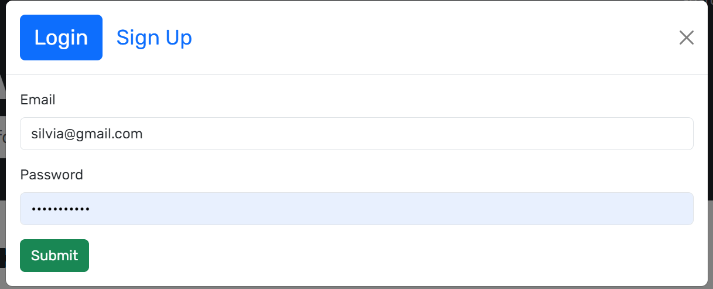
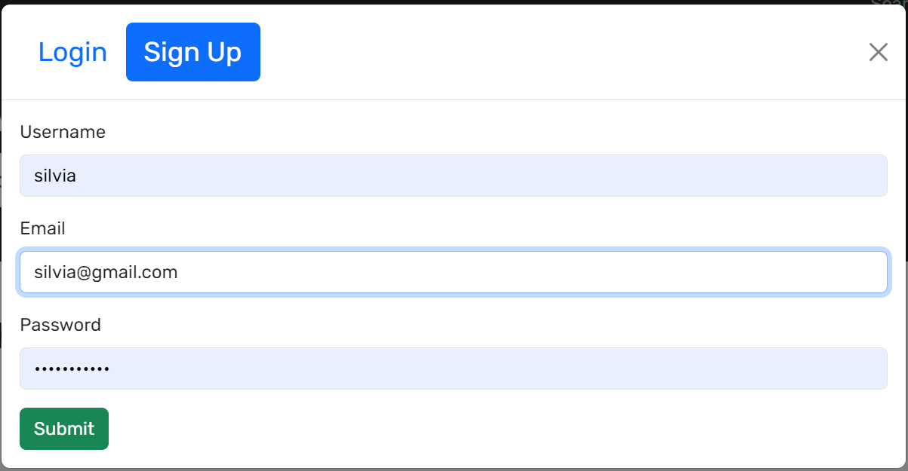
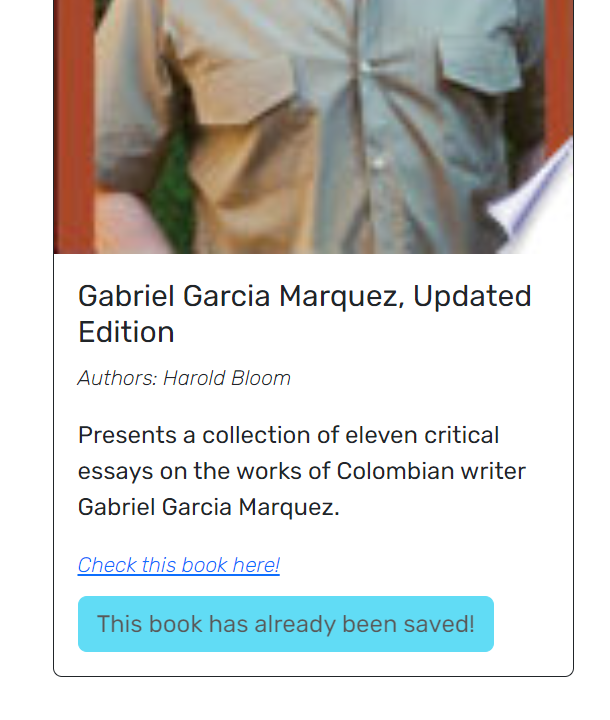

# 📖Book Search Engine

This project is a refactoring of a fully functioning Google Books API search engine, which was initially built with a RESTful API. The refactoring process involves transforming it into a GraphQL API using Apollo Server.

## Description

The Book Search Engine project is a robust and interactive web application that allows users to search for their favorite books using the Google Books API. Initially built with a RESTful API, the application has been refactored to use a GraphQL API with Apollo Server. User authentication is handled using JSON Web Tokens (JWT), providing secure access and maintaining user sessions. This transformation enhances the efficiency of data retrieval by allowing clients to specify exactly what data they need, reducing the amount of data transferred over the network and improving performance. The application continues to provide a user-friendly interface and a seamless book searching experience, now with the added benefits of GraphQL technology and secure JWT authentication.

[](https://opensource.org/licenses/MIT)

## Database-Appearance

Schema from MongoDB Compass tool:
📍

Application deployed using Render:
[LINK-APPLICATION](https://book-search-engine-nivn.onrender.com/)

## Table of Contents
- [📖Book Search Engine](#book-search-engine)
  - [Description](#description)
  - [Database-Appearance](#database-appearance)
  - [Table of Contents](#table-of-contents)
  - [Installation](#installation)
  - [Usage](#usage)
  - [Credits](#credits)
  - [💻Technologies Used](#technologies-used)
  - [License](#license)
  - [Website appearance](#website-appearance)
  - [Features](#features)
  - [Contributing](#contributing)
  - [Tests](#tests)
  - [❔Questions](#questions)

## Installation

To install this application, you'll need Node.js and npm installed on your computer. Follow these steps:

1. Clone this repository to your local machine using `git clone <https://github.com/NathaliaReyes/book-search-engine.git>` or `git clone <git@github.com:NathaliaReyes/book-search-engine.git>`.
2. Navigate to the root directory of the cloned repository in your terminal by running `cd book-search-engine/Develop`.
3. Install the necessary npm packages by running `npm install`.
4. Create a `.env` file in the root directory and add the following environment variables:

```properties
MONGODB_URI='YOUR_DATABASE_URI/googlebooks'
AUTH_SECRET='YOUR_SECRET_WORD'
Replace the MONGODB_URI value with your MongoDB connection string and AUTH_SECRET with your chosen secret.
```

5. Once the installation is complete, you can start the application by running `npm run develop`. This command will concurrently run both the client and server side of the application.

Please refer to the `Usage` section for more details on how to use the application.

## Usage

1. **Access the application:** Navigate to the deployed application URL. You will be presented with a search bar to look for books.

2. **Search for books:** Enter the title, author, or keywords related to the book you're looking for in the search bar and press enter. The application will display a list of books matching your search criteria.

3. **Create an account or log in:** To interact with the application, you will need to log in. Click on the "Login" button and enter your credentials. If you do not have an account, click on "Sign Up" to create a new account.

4. **Add books to your profile:** After logging in, you can add books to your profile. Click on the "Save this Book!" button next to any book in the search results to add it to your profile.

5. **View your profile:** Navigate to your profile to view the books you've added. You can access your profile by clicking on your username at the top of the page.

6. **Delete books from your profile:** If you want to remove a book from your profile, navigate to your profile, find the book you want to remove, and click the "Delete this Book!" button next to it.

## Credits

This project was completed in collaboration with the following team members:

- [Silvia Reyes]([GitHub profile 💼](https://github.com/NathaliaReyes))

Some material and concepts used in this challenge were learned from the [University of Denver Bootcamp](https://bootcamp.du.edu/coding/).

## 💻Technologies Used

This project was built using the following technologies:

- [Apollo Server](https://www.apollographql.com/docs/apollo-server/)
- [GraphQL](https://graphql.org/)
- [React](https://reactjs.org/)
- [React Router Dom](https://reactrouter.com/web/guides/quick-start)
- [React Bootstrap](https://react-bootstrap.github.io/)
- [Bootstrap](https://getbootstrap.com/)
- [JWT-decode](https://www.npmjs.com/package/jwt-decode)
- [Vite](https://vitejs.dev/)
- [ESLint](https://eslint.org/)
- [Concurrently](https://www.npmjs.com/package/concurrently)
- [dotenv](https://www.npmjs.com/package/dotenv)
- [@apollo/client](https://www.apollographql.com/docs/react/)
- [@types/react](https://www.npmjs.com/package/@types/react)
- [@types/react-dom](https://www.npmjs.com/package/@types/react-dom)
- [@vitejs/plugin-react](https://www.npmjs.com/package/@vitejs/plugin-react)
- [eslint-plugin-react](https://www.npmjs.com/package/eslint-plugin-react)
- [eslint-plugin-react-hooks](https://www.npmjs.com/package/eslint-plugin-react-hooks)

## License

This project is licensed under the terms of the [MIT License](https://opensource.org/licenses/MIT).

## Website appearance

Login page:



Sign Up page:



Homepage after the user is Loggen In:


When a book is already saved:



The user can delete a book from their saved books:


## Features

+ **Book Search:** Users can search for books using the Google Books API. They can enter the title, author, or keywords related to the book they're looking for.

+ **User Registration and Authentication:** Users can create a new account and log in. This ensures that only authenticated users can save books to their profile.

+ **Save Books:** Authenticated users can save books from their search results to their profile for easy access later.

+ **View Saved Books:** Users can view a list of books they've saved on a separate page.

+ **Delete Saved Books:** Users can remove books from their saved list if they no longer want them there.

+ **Responsive Design:** The application is responsive and can be used on various devices - desktops, tablets, and mobile phones.

+ **Secure User Authentication:** User authentication is handled using JSON Web Tokens (JWT), providing secure access and maintaining user sessions.

## Contributing

Any contributions you make are **greatly appreciated**.

1. Fork the Project
2. Create your Feature Branch (`git checkout -b feature`)
3. Commit your Changes (`git commit -m 'Add some feature'`)
4. Push to the Branch (`git push origin feature`)
5. Open a Pull Request

## Tests

n/a

## ❔Questions
If you have any questions, feedback, or suggestions, feel free to reach out! You can contact us through our GitHub profiles or via email.

GitHub Profile 💻: [NathaliaReyes](https://github.com/NathaliaReyes)
Email 📧: snrvdevelopment@gmail.com
LinkedIn 👩🏻‍💻: [SilviaReyes](https://www.linkedin.com/in/silvia-reyes-2b907123b/)

Thanks for stopping by! 😊

If you have any questions or feedback, feel free to open an issue or submit a pull request. Happy coding! 👩‍💻👨‍💻

